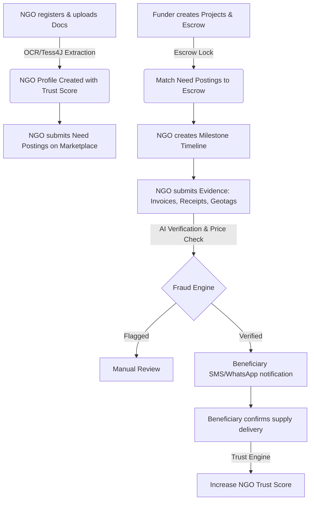

# Transparency Chain - Team Handover & Development Guide

Welcome to the **Transparency Chain** project! This repository contains a full-stack platform built to track CSR (Corporate Social Responsibility) and SDG (Sustainable Development Goals) funding with AI-powered proof-of-spend verification and blockchain integrity.

---

## 🔄 Project Architecture & Flow

Transparency Chain operates through a clear lifecycle across 7 integrated layers:



### Flow Breakdown:
1. **Layer 0 (Identity):** Users register as Funder, NGO, Auditor, or Beneficiary. NGOs undergo document OCR check (using Tess4J fallback or Document AI) to verify NGO details, registered address, and board members.
2. **Layer 1 & 2 (Funding & Matching):** NGOs post their specific resource needs (Need Postings) to the **Marketplace**. Funders browse the marketplace, create Projects with matched escrow accounts, and fund the NGO's posting.
3. **Layer 3 (Milestones):** Once matched, the NGO establishes a vertical timeline of Milestones with specific budget allocations and required evidence templates.
4. **Layer 4 & 5 (Proof-of-Spend & AI Forensics):** The NGO uploads spend proof (e.g. invoices, site photos) against a milestone. The backend performs:
   - **Tess4J OCR** to extract price items from invoices.
   - **Price Variance Analysis** against a reference database price index.
   - **Forensics / Geotag matching** (checks invoice location vs project coordinates).
5. **Layer 6 (Public Auditing):** A public ledger and webhook simulations dispatch verification alerts to local beneficiaries, whose confirmation boosts the NGO's Trust Score.

---

## 🛠️ Getting Started & Setup

Follow these instructions to run the project on any development laptop.

### 📋 Prerequisites
Make sure your system has the following installed:
* **Java SDK (Java 17 or higher)**
* **Maven**
* **Node.js (v18 or higher) & npm**
* **MariaDB or MySQL** server running locally on port `3306`

### 🗄️ Database Setup
The application connects to a MariaDB database. Ensure you have the database created:
1. Log into your database console:
   ```bash
   mysql -u root -p
   ```
2. Run the SQL commands:
   ```sql
   CREATE DATABASE transparency_chain;
   ```
3. Update the credentials in `backend/src/main/resources/application.yml` if your local username or password differs:
   ```yaml
   spring:
     datasource:
       url: jdbc:mariadb://localhost:3306/transparency_chain?createDatabaseIfNotExist=true
       username: root
       password: root
   ```

### 🚀 Running the Servers

#### Running Backend (Spring Boot)
Open a terminal in the `backend/` directory and execute:
```bash
mvn spring-boot:run
```
* The backend server binds to **`http://localhost:8081`**.
* Automatically seeds initial demo users, projects, and milestones on the first boot.

#### Running Frontend (React Vite)
Open a separate terminal in the `frontend/` directory and execute:
```bash
npm install     # Only needed on first startup
npm run dev
```
* The frontend server binds to **`http://localhost:5173`**.

### 🤖 One-Click Automation & Verification

We have added three utility scripts to automate execution, testing, and lifecycle management:

1. **Start the Application:**
   Runs checks, automatically applies database schema patches, and starts the backend and frontend in the background, waiting for both to be fully responsive.
   ```bash
   bash start.sh
   ```
2. **Verify System Functionality (50-Step Integration Suite):**
   Runs a comprehensive end-to-end integration verification suite testing authentication, role enforcement, marketplace discovery, milestone detail, engagement state transition, change request raising, duplicate guards, counter proposals, acceptance state locks, and withdrawal flows. It resets the database state automatically before testing for complete idempotency.
   ```bash
   bash verify.sh
   ```
3. **Stop the Application:**
   Gracefully stops all backend and frontend background processes.
   ```bash
   bash stop.sh
   ```

---

## 📝 Recent Changes & Seeding Updates

To allow teammates to clone and run the project out-of-the-box, we made the following updates:

1. **Automatic Demo Seeding (`DemoDataSeeder.java`):**
   * Modified the seeder to check for the target NGO user: `727724eucy040@skcet.ac.in`.
   * **If not found:** The seeder automatically registers and saves this user in the database with the role `NGO` and password `password`.
   * Hashed all passwords (`password` for the NGO, `demo` for the Funder) using `PasswordEncoder` so that teammates can successfully log in using these credentials immediately after start.
   * Auto-seeds the NGO profile, Funder profile (`dummyfunder@demo.com`), 2 sample projects, and 3 milestone items.
2. **Database Clean-up:**
   * Resolved schema alteration issues. During initial table updates, Hibernate throws constraints conflicts if altering tables with existing foreign keys. Recreating the database (`transparency_chain`) resolves all DDL constraint compilation issues.

---

## 🚨 Troubleshooting Guide

### 1. Port Conflict (Port 8081 or 5173 is already in use)
If you get `Port 8081 is already in use`, check which process is running on it and kill it:
```bash
# Check port
lsof -i :8081
# Kill the process
kill -9 <PID>
```

### 2. Hibernate Foreign Key Migration Constraint Error
If the backend crashes with:
`Cannot change column 'milestone_id': used in a foreign key constraint '...'`
Hibernate is attempting to alter a column that is locked by an existing foreign key. Clean the database structure:
```bash
mysql -u root -proot -e "DROP DATABASE transparency_chain; CREATE DATABASE transparency_chain;"
```
Then restart the backend. Hibernate will regenerate the tables cleanly and seed the initial data.

---

## 👥 Demo Credentials
Once you start the servers, use these pre-seeded accounts to explore the application:

* **NGO Account:**
  * **Email:** `727724eucy040@skcet.ac.in`
  * **Password:** `password`
* **Funder Account:**
  * **Email:** `dummyfunder@demo.com`
  * **Password:** `demo`
